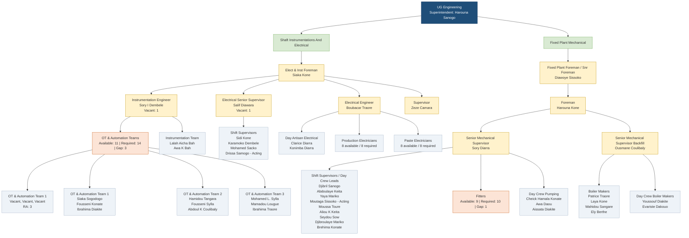

# Engineering Gounkoto - Organogramme Chart

## Headcount Summary

### Electrical And Instrumentation

| Position | Available | Requirement | Gap |
|---|---:|---:|---:|
| Foreman | 1 | 1 | 0 |
| Inst Eng | 1 | 2 | 1 |
| Elect Eng | 1 | 1 | 0 |
| Snr Sup | 2 | 3 | 1 |
| OT & Auto Team | 11 | 14 | 3 |
| Shift Sup | 6 | 6 | 0 |
| Prod Elec | 8 | 8 | 0 |
| Paste Elec | 8 | 8 | 0 |

### Fixed Plant Mechanical

| Position | Available | Requirement | Gap |
|---|---:|---:|---:|
| Snr Foreman | 1 | 1 | 0 |
| Foreman | 1 | 1 | 0 |
| Snr Sup | 2 | 2 | 0 |
| Shift Sup | 9 | 9 | 0 |
| Fitters | 9 | 10 | 1 |
| DS Pumping | 3 | 3 | 0 |
| Boilermakers | 6 | 6 | 0 |
